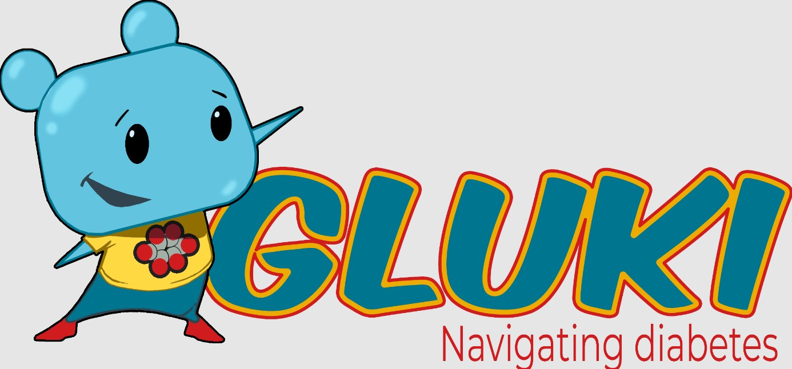

## Hi, I'm Jane 👋

<!--
**janelai/janelai** is a ✨ _special_ ✨ repository because its `README.md` (this file) appears on your GitHub profile.

Here are some ideas to get you started:

- 🔭 I’m currently working on ...
- 🌱 I’m currently learning ...
- 👯 I’m looking to collaborate on ...
- 🤔 I’m looking for help with ...
- 💬 Ask me about ...
- 📫 How to reach me: ...
- 😄 Pronouns: ...
- ⚡ Fun fact: ...
-->

🎓 CS Graduate from UC Irvine, current Frontend Developer at Prism Software, and M.S. Data Science student at UC Berkeley.

🌱 Exploring interests in AI/ML, frontend development, and data analytics.

**🛠️ Skills**

- Languages & Frameworks: Python, C++, JavaScript (React, Angular, TypeScript, Node), HTML, CSS, SQL, R
- Development Tools: AWS, Azure DevOps, TeamCity, Git, Docker

👩‍💻 I’m actively looking for full-time roles in Software Engineering, Frontend Development, and Data Analysis/Engineering. I’m passionate about working on impactful projects that combine data-driven decision-making with technology and design to solve real-world problems. If you’re interested in collaborating, please feel free to connect with me via the following platforms!

- 📧 [jane.e.lai@gmail.com](mailto:jane.e.lai@gmail.com)
- 🔗 [linkedin.com/jane-e-lai](https://www.linkedin.com/in/jane-e-lai/)

## Portfolio

### [Modeling Age-Based Disparities in Workplace Technology Adoption](https://github.com/janelai/Modeling-Age-Based-Disparities-in-Workplace-Technology-Adoption)

  
  This project investigates how the percentage of time spent using electronic technologies at work varies by age. The analysis explores age-related disparities in technology usage across different job types and industries. By examining the relationship between age, work hours, and technology adoption while controlling for industry and occupation, the study aims to provide insights into workforce development and inform policies on technology training and support for diverse age groups in professional environments.

 

### [Partisan Divergence in Education Policy Preferences: A Statistical Exploration](https://github.com/janelai/Partisan-Divergence-in-Education-Policy-Preferences-A-Statistical-Exploration)

  
  This project conducts a quantitative analysis to explore partisan disparities in primary and secondary education policy preferences between Democratic and Republican voters. Using data from the ANES 2024 Pilot Study, the analysis examines attitudes toward education, including views on the role of college professors and perceptions of party handling of public school curricula. The goal is to uncover any significant differences in how voters from each party approach education policy and to provide insights into the impact of political affiliation on educational priorities.

 

### [Graph-Theoretical Approach to Uncovering Hidden Risks in Stock Market Portfolios](https://github.com/janelai/Graph-Theoretical-Approach-to-Uncovering-Hidden-Risks-in-Stock-Market-Portfolios)

  
  This project models stocks as a correlation network to uncover hidden dependencies that traditional sector-based diversification overlooks. Using the Louvain algorithm to detect clusters of correlated assets and PageRank to identify influential stocks, it reveals cross-sector relationships and systemic risks not visible in standard models.

 

### [Insul-in Prototype](https://github.com/janelai/Insul-In_Prototype)

  
  Insul-in is a mobile game developed as part of project GLUKI to educate young children with Type 1 Diabetes on the process of administering insulin. The game takes on a "brick breaker"-style format, making learning about insulin administration fun and interactive. The app aims to teach children the importance of managing their condition through gameplay, combining education with entertainment to help reinforce key concepts. This project was developed by a team of 5 using Unity Canvas, with design mock-ups created in Figma. As the UI artist, I designed the in-game user interface, including the HUD and other creative components.

