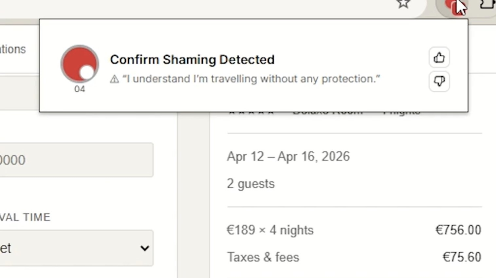
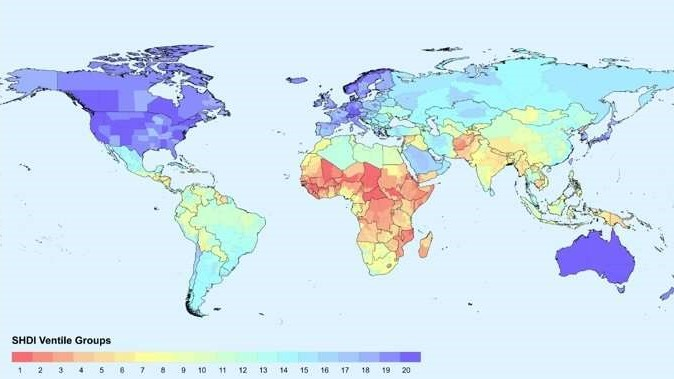

## Hi, I'm Jane 👋

<!--
**janelai/janelai** is a ✨ _special_ ✨ repository because its `README.md` (this file) appears on your GitHub profile.

Here are some ideas to get you started:

- 🔭 I’m currently working on ...
- 🌱 I’m currently learning ...
- 👯 I’m looking to collaborate on ...
- 🤔 I’m looking for help with ...
- 💬 Ask me about ...
- 📫 How to reach me: ...
- 😄 Pronouns: ...
- ⚡ Fun fact: ...
-->

🎓 B.S. Computer Science graduate from UC Irvine | current M.S. Information & Data Science candidate at UC Berkeley (expected May 2026)

💼 Software Engineer at Prism Software

🌱 Exploring the intersection of AI/ML, full-stack development, data analytics, and human-centered design.

## 🛠️ Skills

**Languages:** Python, JavaScript/TypeScript, SQL, R, HTML, CSS

**Frontend:** React, Next.js, Angular, Redux, Material-UI, Tailwind

**Backend & Databases:** Node.js, PostgreSQL, Supabase, MongoDB, REST APIs

**ML & Data Science:** PyTorch, HuggingFace, XGBoost, scikit-learn, LangChain, Qdrant, Pandas, NumPy, NetworkX

**Data Visualization:** D3.js, Tableau, Altair, Matplotlib, Mermaid

**Cloud & DevOps:** AWS (Lambda, CloudWatch, S3, VPC), Azure DevOps, Vercel, Docker, Git, TeamCity, CI/CD

## 💡 Interests

AI/ML, full-stack development, data visualization, ethics & privacy in tech, accessibility, and civic tech. Passionate about impactful projects that combine data-driven decision-making with thoughtful design.

## 📫 Let's Connect

Open to full-time Software Engineering and Data Analysis/Engineering opportunities starting May 2026. If you're interested in collaborating, please reach out!

- 📧 [jane.e.lai@gmail.com](mailto:jane.e.lai@gmail.com)
- 🔗 [linkedin.com/jane-e-lai](https://www.linkedin.com/in/jane-e-lai/)

## Portfolio

### [Deceptive Pattern Detector](https://github.com/janelai/deceptive-pattern-detector)   <i>January - April 2026 · UC Berkeley MIDS Capstone</i>

  
  I built a browser extension that detects deceptive design patterns on websites in real time using a two-tier detection system. A lightweight client-side gatekeeper (regex rules and ONNX/WASM inference) filters candidate elements before sending them to cloud-hosted XGBoost models trained per pattern type. The system includes a nightly online retraining pipeline with Golden Set evaluation, versioning, and rollback, along with a performance dashboard to monitor model drift. The goal is to help users recognize manipulative UI tactics as they browse, promoting more transparent digital experiences.

 

### [Congressional Data Visualization](https://github.com/UC-Berkeley-I-School/final-project-209-congress)   <i>October - December 2025</i>

  
  This data visualization website explores the 119th US Congress through the lens of generational cohorts, examining how legislative activity varies by age group, party affiliation, and geographic region. Using data from Congress.gov and demographic sources, I developed interactive D3.js visualizations that surface patterns in bill sponsorship, committee participation, and voting behavior across generations. The project aims to make congressional data more accessible and reveal how generational shifts shape policy priorities in US government.

 

### [Predicting Eurovision Placements using ML](https://github.com/janelai/Modeling-Age-Based-Disparities-in-Workplace-Technology-Adoption)   <i>June - August 2025</i>

  
  This project predicts final placements in the Eurovision Song Contest using machine learning models trained on historical contest data, including performance order, country of origin, language, and audio features of each entry. I framed the task as an ordinal regression problem to respect the ranked nature of the target variable and compared several model architectures implemented in TensorFlow to evaluate predictive performance. The study explores how musical and contextual factors influence placement outcomes and highlights the challenges of modeling a competition shaped by both artistic judgment and geopolitical voting patterns.

 

### [Modeling Age & Workplace Technology Adoption](https://github.com/janelai/Modeling-Age-Based-Disparities-in-Workplace-Technology-Adoption)   <i>March - April 2025</i>

  
  This project investigates how the percentage of time spent using electronic technologies at work varies by age across different industries and occupations. Using regression modeling, I examined the relationship between age, work hours, and technology adoption while controlling for job type and industry to isolate age-specific effects. The analysis aims to provide insights into workforce development and inform policies on technology training and support for diverse age groups in professional environments.

 

### [Uncovering Risks in Stock Portfolios](https://github.com/janelai/Graph-Theoretical-Approach-to-Uncovering-Hidden-Risks-in-Stock-Market-Portfolios)   <i>January - April 2025</i>

  
  This project models the stock market as a correlation network to uncover hidden dependencies that traditional sector-based diversification overlooks. I applied the Louvain algorithm to detect clusters of correlated assets and used PageRank to identify the most systemically influential stocks within the network. The results reveal cross-sector relationships and concentration risks not visible in standard portfolio models, offering a graph-based perspective on how shocks can propagate across seemingly unrelated holdings.

 

### [Partisan Divergence in Education Policy](https://github.com/janelai/Partisan-Divergence-in-Education-Policy-Preferences-A-Statistical-Exploration)   <i>January - February 2025</i>

  
  This project analyzes partisan disparities in primary and secondary education policy preferences between Democratic and Republican voters using data from the ANES 2024 Pilot Study. I examined attitudes toward college professors, perceptions of each party's handling of public school curricula, and broader views on educational priorities, applying statistical testing to quantify the significance of observed divergences. The goal is to understand how political affiliation shapes education policy preferences and where the two parties most sharply diverge.

 

### [Global Socioeconomic Indicators](https://github.com/janelai/Global-Socioeconomic-Indicators-A-Multivariate-Analysis)   <i>November - December 2024</i>

  
  This project analyzes the relationship between global socioeconomic indicators, including government expenditure on education and GDP per capita, across Western Europe, Western Africa, and South Asia using World Development Indicators data (2000–2023). I applied clustering and influence analysis to explore how education spending and economic development correlate within each region and to surface cross-sector relationships not typically captured by standard models. The findings offer a nuanced view of the factors driving economic growth and educational disparities across diverse regional contexts.

 
