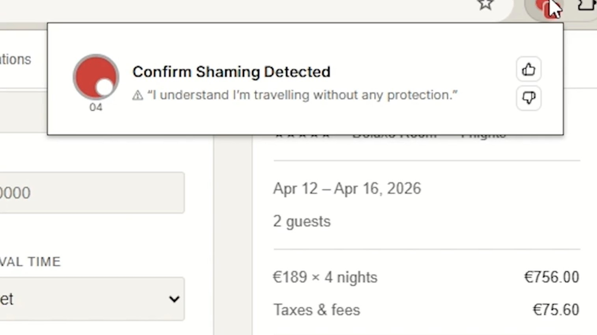
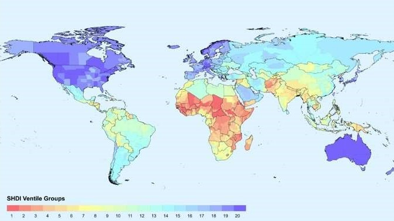

## Hi, I'm Jane 👋

<!--
**janelai/janelai** is a ✨ _special_ ✨ repository because its `README.md` (this file) appears on your GitHub profile.

Here are some ideas to get you started:

- 🔭 I’m currently working on ...
- 🌱 I’m currently learning ...
- 👯 I’m looking to collaborate on ...
- 🤔 I’m looking for help with ...
- 💬 Ask me about ...
- 📫 How to reach me: ...
- 😄 Pronouns: ...
- ⚡ Fun fact: ...
-->

🎓 B.S. Computer Science graduate from UC Irvine | cM.S. Information & Data Science candidate at UC Berkeley (expected May 2026)

💼 Software Engineer at Prism Software

🌱 Building at the intersection of AI/ML, full-stack development, data analytics, and human-centered design.

## 🛠️ Skills

**Languages:** Python, JavaScript/TypeScript, SQL, R, HTML, CSS

**Frontend:** React, Next.js, Angular, Redux, Material-UI, Tailwind

**Backend & Databases:** Node.js, PostgreSQL, Supabase, MongoDB, REST APIs

**ML & Data Science:** PyTorch, Hugging Face, XGBoost, scikit-learn, LangChain, Qdrant, Pandas, NumPy, NetworkX

**Data Visualization:** D3.js, Tableau, Altair, Matplotlib, Mermaid

**Cloud & DevOps:** AWS (Lambda, CloudWatch, S3, VPC), Azure DevOps, Vercel, Docker, Git, TeamCity, CI/CD

## 💡 Interests

AI/ML, full-stack development, data visualization, ethics & privacy in tech, accessibility, and civic tech. I'm drawn to projects that pair data-driven decision-making with thoughtful, human-centered design.

## 📫 Let's Connect

Open to full-time Software Engineering and Data Analysis/Engineering roles starting May 2026. Reach out if you'd like to collaborate or chat!

- 📧 [jane.e.lai@gmail.com](mailto:jane.e.lai@gmail.com)
- 🔗 [linkedin.com/jane-e-lai](https://www.linkedin.com/in/jane-e-lai/)

## Portfolio

### [Deceptive Pattern Detector](https://github.com/janelai/deceptive-pattern-detector)   <i>January - April 2026 · UC Berkeley MIDS Capstone</i>

  
  A browser extension that detects deceptive design patterns on websites in real time using a two-tier detection system. A lightweight client-side gatekeeper (regex rules and ONNX/WASM inference) filters candidate elements before sending them to cloud-hosted XGBoost models trained per pattern type. The system includes a nightly online retraining pipeline with Golden Set evaluation, versioning, and rollback, plus a performance dashboard to monitor model drift, helping users recognize manipulative UI tactics as they browse.

 

### Retrieval-Augmented Generation (RAG) System   <i>Mar - Apr 2026</i>

  A RAG pipeline built with LangChain, Qdrant, and Cohere's Command R model to improve retrieval-grounded response accuracy. Evaluated using ROUGE-L and BERTScore to benchmark generation quality against baseline approaches.

 

### QLoRA Fine-Tuning for Sentiment Classification   <i>Feb - Mar 2026</i>

  Fine-tuned a Gemma-2-2B model using QLoRA on the SST2 dataset via Hugging Face, reducing compute requirements while maintaining classification performance.

 

### [Congressional Data Visualization](https://github.com/UC-Berkeley-I-School/final-project-209-congress)   <i>October - December 2025</i>

  
  An interactive data visualization site exploring the 119th US Congress through the lens of generational cohorts — examining how legislative activity varies by age group, party affiliation, and geographic region. Built with D3.js using data from Congress.gov and demographic sources to surface patterns in bill sponsorship, committee participation, and voting behavior across generations.

 

### [Predicting Eurovision Placements using Machine Learning]   <i>June - August 2025</i>

  
  Predicted final placements in the Eurovision Song Contest using machine learning models trained on historical contest data, including performance order, country of origin, language, and audio features. Framed as an ordinal regression problem to respect the ranked nature of the target variable, comparing several model architectures in TensorFlow.

 
<!--
### [Modeling Age & Workplace Technology Adoption](https://github.com/janelai/Modeling-Age-Based-Disparities-in-Workplace-Technology-Adoption)   <i>March - April 2025</i>

  
  Investigated how the percentage of time spent using electronic technologies at work varies by age across industries and occupations. Used regression modeling to examine the relationship between age, work hours, and technology adoption while controlling for job type and industry to isolate age-specific effects.

 
-->
### [Uncovering Risks in Stock Portfolios](https://github.com/janelai/Graph-Theoretical-Approach-to-Uncovering-Hidden-Risks-in-Stock-Market-Portfolios)   <i>January - April 2025</i>

  
  Modeled the stock market as a correlation network to uncover hidden dependencies that traditional sector-based diversification overlooks. Applied the Louvain algorithm to detect clusters of correlated assets and PageRank to identify systemically influential stocks, revealing cross-sector relationships and concentration risks not visible in standard portfolio models.

 
<!--
### [Partisan Divergence in Education Policy](https://github.com/janelai/Partisan-Divergence-in-Education-Policy-Preferences-A-Statistical-Exploration)   <i>January - February 2025</i>

  
  Analyzed partisan disparities in primary and secondary education policy preferences using ANES 2024 Pilot Study data, examining attitudes toward college professors, perceptions of each party's handling of public school curricula, and broader educational priorities, with statistical testing to quantify observed divergences.

 
-->
<!--
### [Global Socioeconomic Indicators](https://github.com/janelai/Global-Socioeconomic-Indicators-A-Multivariate-Analysis)   <i>November - December 2024</i>

  
  Analyzed the relationship between global socioeconomic indicators — including government education expenditure and GDP per capita — across Western Europe, Western Africa, and South Asia using World Development Indicators data (2000–2023). Applied clustering and influence analysis to surface cross-sector relationships not typically captured by standard models.

 
-->
-->
