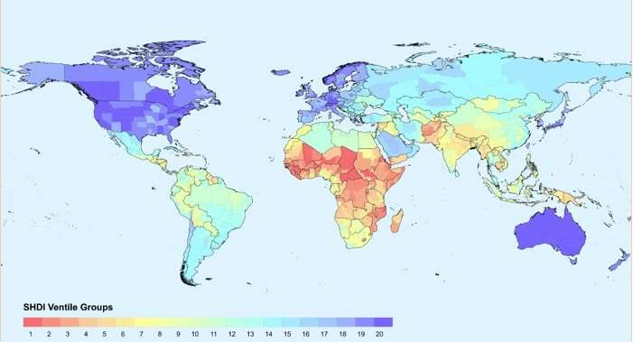

## Hi, I'm Jane 👋

<!--
**janelai/janelai** is a ✨ _special_ ✨ repository because its `README.md` (this file) appears on your GitHub profile.

Here are some ideas to get you started:

- 🔭 I’m currently working on ...
- 🌱 I’m currently learning ...
- 👯 I’m looking to collaborate on ...
- 🤔 I’m looking for help with ...
- 💬 Ask me about ...
- 📫 How to reach me: ...
- 😄 Pronouns: ...
- ⚡ Fun fact: ...
-->

🎓 CS Graduate from UC Irvine, current Frontend Developer at Prism Software, and M.S. Data Science student at UC Berkeley.

🌱 Exploring interests in AI/ML, frontend development, and data analytics.

**🛠️ Skills**

- Languages & Frameworks: Python, C++, JavaScript (React, Angular, TypeScript, Node), HTML, CSS, SQL, R
- Development Tools: AWS, Azure DevOps, TeamCity, Git, Docker

👩‍💻 I’m actively looking for full-time roles in Software Engineering, Frontend Development, and Data Analysis/Engineering. I’m passionate about working on impactful projects that combine data-driven decision-making with technology and design to solve real-world problems. If you’re interested in collaborating, please feel free to connect with me via the following platforms!

- 📧 [jane.e.lai@gmail.com](mailto:jane.e.lai@gmail.com)
- 🔗 [linkedin.com/jane-e-lai](https://www.linkedin.com/in/jane-e-lai/)

## Portfolio

### [Plant Tracker App](https://github.com/janelai/plant-tracker)

  
  This project is a simple and intuitive tool designed for plant lovers to easily manage and care for their plants. With this app, users can store plant details like names, species, and photos, while keeping track of care activities such as watering and repotting. It offers the convenience of setting reminders to stay on top of watering schedules and logs plant care actions. A project in the works :)

 

### [Partisan Divergence in Education Policy Preferences: A Statistical Exploration](https://github.com/janelai/Partisan-Divergence-in-Education-Policy-Preferences-A-Statistical-Exploration)

  
  This project conducts a quantitative analysis to explore partisan disparities in primary and secondary education policy preferences between Democratic and Republican voters. Using data from the ANES 2024 Pilot Study, the analysis examines attitudes toward education, including views on the role of college professors and perceptions of party handling of public school curricula. The goal is to uncover any significant differences in how voters from each party approach education policy and to provide insights into the impact of political affiliation on educational priorities.

 

### [Graph-Theoretical Approach to Uncovering Hidden Risks in Stock Market Portfolios](https://github.com/janelai/Graph-Theoretical-Approach-to-Uncovering-Hidden-Risks-in-Stock-Market-Portfolios)

  
  This project models stocks as a correlation network to uncover hidden dependencies that traditional sector-based diversification overlooks. Using the Louvain algorithm to detect clusters of correlated assets and PageRank to identify influential stocks, it reveals cross-sector relationships and systemic risks not visible in standard models.

 

### [Global Socioeconomic Indicators: A Multivariate Analysis](https://github.com/janelai/Global-Socioeconomic-Indicators-A-Multivariate-Analysis)

  
  This project analyzes the relationship between various global socioeconomic indicators, including government expenditure on education and GDP per capita, across three regions: Western Europe, Western Africa, and South Asia. Using a dataset from World Development Indicators (2000-2023), the study explores how education spending and economic development correlate within different regions, revealing nuanced insights into the factors that drive economic growth and educational disparities. Statistical methods such as clustering and influence analysis were applied to uncover hidden dependencies and cross-sector relationships not typically visible in standard models.

 

### [Insul-in Prototype](https://github.com/janelai/Insul-In_Prototype)

  
  Insul-in is a mobile game developed as part of project GLUKI to educate young children with Type 1 Diabetes on the process of administering insulin. The game takes on a "brick breaker"-style format, making learning about insulin administration fun and interactive. The app aims to teach children the importance of managing their condition through gameplay, combining education with entertainment to help reinforce key concepts. This project was developed by a team of 5 using Unity Canvas, with design mock-ups created in Figma. As the UI artist, I designed the in-game user interface, including the HUD and other creative components.

